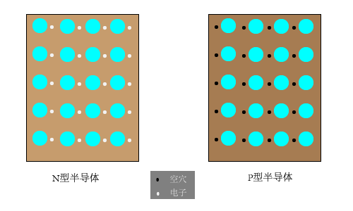
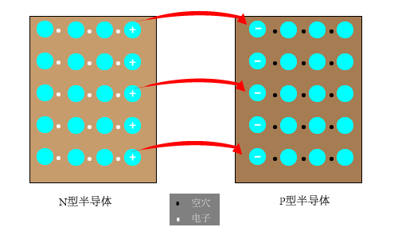

# 第一张 常用半导体器件
### PN结的形成和特性
在本征半导体上参杂，就可以使半导体的导电性能大大增强。如果参入磷元素，在共价键的作用下会多出一个电子，该电子很容易逃逸（N型半导体)。如果参入硼元素，在共价键的作用下有7个电子，该结构很容易获得电子(P型半导体。  

如果将P型半导体和N型半导体做在一起，由于两块半导体自由电子的浓度差别很大，则会发生扩散现象。N型半导体由于失去电子，则带正电荷，而P型半导体由于获得电子，则带负电荷。这样会在两块半导体之间形成内电场，该内电场对自由电子的扩散进行阻碍，随着扩散的持续，内电场越来越强，最后处于稳定状态。  

