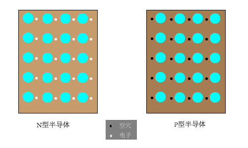

# 第一章 常用半导体器件
### 1.  PN结的形成和特性
#### PN结的形成过程
在本征半导体上参杂，就可以使半导体的导电性能大大增强。如果参入磷元素，在共价键的作用下会多出一个电子，该电子很容易逃逸（N型半导体)。如果参入硼元素，在共价键的作用下有7个电子，该结构很容易获得电子(P型半导体。  

如果将P型半导体和N型半导体做在一起，由于两块半导体自由电子的浓度差别很大，则会发生扩散现象。N型半导体由于失去电子，则带正电荷，而P型半导体由于获得电子，则带负电荷。这样会在两块半导体之间形成内电场，该内电场对自由电子的扩散进行阻碍，随着扩散的持续，内电场越来越强，最后处于稳定状态。  

#### PN结的单向导通性
* 给PN结加上一个与内部电场方向相同的电场，则会进一步遏制多子的扩散，并使空间电荷区加宽。此时，PN结截至。   
* 反之，给PN结加上一个与内部电场相反的外部电场，则会促进多子的运动，从而使PN结导通。此时，空间电荷区变窄。  

#### PN结的动态电阻  
根据PN结正向导通的伏安特性曲线，当流过PN结的电流动态变化时，PN结就等效为一个动态电阻,此电阻值的计算公式如下：  
  

U.T在常温下，即 T = 300K 时，U.T ≈ 26mV。 U.T为温度的电压当量。
  
***

