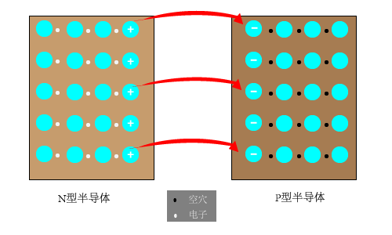
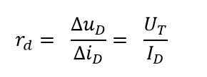

# 第一章 常用半导体器件
### 1.  PN结的形成和特性
#### 1.1 PN结的形成过程
* 在本征半导体上参杂，就可以使半导体的导电性能大大增强。如果参入磷元素，在共价键的作用下会多出一个电子，该电子很容易逃逸（N型半导体)。如果参入硼元素，在共价键的作用下有7个电子，该结构很容易获得电子(P型半导体。  

* 如果将P型半导体和N型半导体做在一起，由于两块半导体自由电子的浓度差别很大，则会发生扩散现象。N型半导体由于失去电子，则带正电荷，而P型半导体由于获得电子，则带负电荷。这样会在两块半导体之间形成内电场，该内电场对自由电子的扩散进行阻碍，随着扩散的持续，内电场越来越强，最后处于稳定状态。  

#### 1.2 PN结的单向导通性
* 给PN结加上一个与内部电场方向相同的电场，则会进一步遏制多子的扩散，并使空间电荷区加宽。此时，PN结截至。   
* 反之，给PN结加上一个与内部电场相反的外部电场，则会促进多子的运动，从而使PN结导通。此时，空间电荷区变窄。  

#### 1.3 PN结的动态电阻  
* 根据PN结正向导通的伏安特性曲线，当流过PN结的电流动态变化时，PN结就等效为一个动态电阻,此电阻值的计算公式如下：  
  

U.T在常温下，即 T = 300K 时，U.T ≈ 26mV。 U.T为温度的电压当量。
  
***
### 2. 半导体二极管
#### 2.1 二极管与PN结的区别
* 二极管和PN结都具有单向导通性.但是二极管存在半导体电阻和引线电阻，加之二极管表面漏电流的存在，在相同的电压下，通过PN的电流大于通过二极管的电流. 也就是说，在相同的电流下，二极管两端的电压要大于PN结两端的电压.
  
#### 2.2 二极管的主要参数
* 最大整流电流I.F：是二极管长期运行时允许通过的最大正向平均电流。
* 反向电流I.R：是二极管未被击穿时的反向电流，I.R越小，二极管的单向导电性越好。
* 最高反向电压U.R：是二极管允许外加的最大电压。通常U.R为击穿电压U.(BR)的一半。
* 最高工作频率f.M: 是二极管工作的上限截至频率。超过此值，二极管的单向导通性会大打折扣。

#### 2.3 稳压二极管
* 只要控制反向电流不超过一定值，管子就不会因为过热而损坏。
* 动态电阻r.z：稳压二极管工作在稳定区时，端电压与端电流的比值。r.z越小，稳压管的稳定特性越好。一般稳压二极管的动态电阻从几欧到几十欧，工作电流越大，稳定效果越好。
* 稳压二极管反向电流小于I.Zmin时不稳压，大于I.Zmax时，因超过而定功率而损坏。稳压二极管工作时，要与之串联一个电阻来限制电流，从而保证稳压二极管正常工作。

